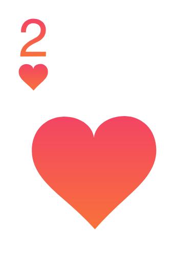
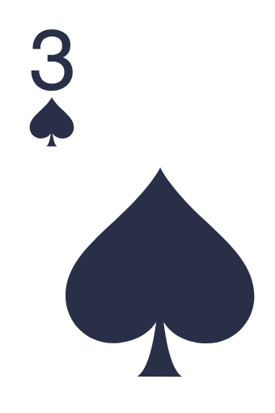
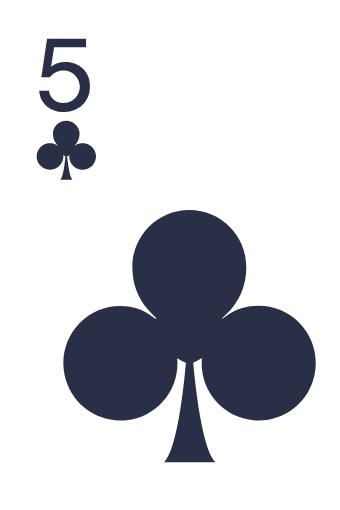
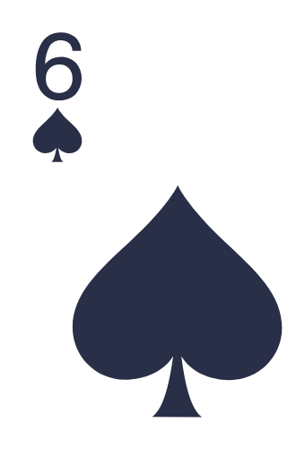

# Backend
{: .fs-8 .no_toc }
The backend side is mainly built on [NodeJS](https://nodejs.org/en/docs/) and [NestJS](https://nestjs.com/) framework. We are also using Typescript to get a better performance.
{: .fs-6 .fw-300}

## Table of contents
{: .no_toc .text-delta }

1. TOC
{:toc}

## Getting started

### Start by cloning the project:

```bash
git clone https://github.com/fulltimeforce/dogker-back
```

### Once it is cloned, install the dependencies:

```bash
npm install
```

### Now you can run the app in development mode:

```bash
npm start
```
or
```
npm run start:dev
```

### The application will run on port 5000.

### To run in production mode, first do:

```bash
npm run build
```

### and then:

```bash
npm run start:prod
```

## Database
We are currently using MongoDB a document-oriented database as well as [mongoose](https://docs.nestjs.com/techniques/mongodb) from NestJS, an Object Data Modeling **(ODM)** library so that we manage our games data.
{: .fs-4 .no_toc }


### **User**
User is the actual player who enters a game and starts playing. Once a user opens the app it will generate a **code** right away that is going to be stored in **code** attribute. This code was generated to create a room and can be used to invite other players as well. As soon as a user enters a room either its own or from another player, it will store the room code in **currentGame**.
{: .fs-4 .no_toc }
{:refdef: style="text-align: center;"}
  
{: refdef}

### **Suggestion**
Suggestion is where we store our suggestions, **forgiving the repitition**. It comes from the [Landing Page](dogker.fulltimeforce.com) when anyone who played Dogker App can send suggestions through a form in there. It will ask a subject which is basically the **title** and the message which is the **suggestion**, all those data will be stored in our collection respectively.
{: .fs-4 .no_toc }
{:refdef: style="text-align: center;"}
  
{: refdef}
## Sockets
We are using sockets which basically allows users/players to send multiple requests to one server. There can be **10 players maximum** in each game whom will send requests continuously such as **betting**, **folding**, **raising bet**, etc. Those methods can be found in [`games.gateway.ts`](https://github.com/fulltimeforce/dogker-back/blob/master/src/games/dto/game.dto.ts)


## Project Structure
```
src\
 |--cron\         # Actions to be executed at certain time
 |--deck\    # All related to cards methods
 |--games\           # Mongoose models, gateway and controller
 |--suggestions\    # Mongoose models, gateway and controller
 |--users\         # Mongoose models, gateway and controller
 |--app.module.ts\         # Interaction among all modules from user,game,cron,etc
 |--main.ts\       # App entry point
```

# In-depth explanation
<hr style="margin: 1rem 0px;" />

<table style="background:#181818">
  <thead>
      <tr>
          <th colspan="5">Table Cards</th>
      </tr>
  </thead>
  <tbody>
      <tr>
          <td style="text-align:center">
            
          </td>
          <td style="text-align:center">
            
          </td>
          <td style="text-align:center">
            
          </td>
          <td style="text-align:center">
            
          </td>
          <td style="text-align:center">
            
          </td>
      </tr>
  </tbody>
</table>
<table class="float-left" style="background:#181818">
    <thead>
        <tr>
            <th colspan="2">Player Cards</th>
        </tr>
    </thead>
    <tbody>
        <tr>
            <td style="text-align:center">
              
            </td>
            <td style="text-align:center">
              
            </td>
        </tr>
    </tbody>
</table>

What we see above is the example of cards unification that are on the table with the cards' player.

Then, we run a evaluator that will give us information about the cards, but firstly it evaluator sorts the cards with `sortPokerHandByValue()` and then evaluates same cards as the highest card.

Finally, we evaluate in which combination the player has made, in the above example the player has made a combination of **Three of a kind**.

## `determinateHandRank()` method
<hr style="margin: 1rem 0px;" />
If we put aside different end cases for a moment, the main problem with solving the card evaluation problem is as follows: We want a player with better combination to win the rest of players with less better combinations, in the case of a tie, the **pot** will be divided.

### Simplying the problem
Given a `cards-table` array with 5 cards, `[10-h, 5-s, 4-s, 2-d, 13-s]`. Each letter have the following meaning `club (c)(♣), diamond (d)(♦), heart (h)(♥) and spade (s)(♠)`. So the table cards and players cards will be put together in an array called `pokerHand` and that array will be passed to another method called `sortPokerHandByValue()` to be sorted by numbers. 
Once it is ordered, it will calculate the combinations. For example: 

```javascript
  {
    Name: Player 01,
    Cards: [10-h, 10-h]
  },
  {
    Name: Player 02,
    Cards: [4-s, 5-h]
  }
```
**Player 01** will be preffered as the `bestHand` over **Player 02** and also be considered with **best** `rank`. That's because **Player 01** has made a better combination of **Three of a kind**, `[10-h, 10-h]` - `[10-h]` whereas **Player 02** made **Pair** combination, `[4-s]` - `[4-s]`.  

### Method's Parameters:
- `playerCards: Array<string>` - Array of player's cards without sorting.

## `determinateGameState()` method
<hr style="margin: 1rem 0px;" />
This method handles responses to do depending of which `action` is given. These actions inside this method are: 
- `call`: This action turns on when a player bets normally.
- `fold`: This actions applies when a player folds, it means that loses the current round.
- `raise`: It means that a player raise a bet.

### Method's Parameters:
- `action: string` - It can be actions coming from multiple functions. e.g: Inside `raise()` method, it calls and pass it as a parameter -> `this.determinateGameState(this.RAISE)`.

## `HandRank` and `HandRankValue` evaluation
<hr style="margin: 1rem 0px;" />
**HandRank** and **HandRankValue** are attributes from `User` class that corresponds to which combination is the best, the following picture details more about rankings that starts with **Royal Flush** as the best one.
{: .fs-4 .no_toc }

{:refdef: style="text-align: center;"}

{:refdef}

Some highlights that need to be made when evaluating the playing cards:

1. We need to give a rank to the group to which the cards combination belong, such as Straight or Two Pairs.
2. When a group of cards is selected (`pokerHand`), it is necessary to evaluate how good the cards are within that group, if some players have the same primary `HandRank` group, we will need to evaluate the `handRankValue`.
3. We will begin by examining the `HandRank`, if there's a HandRank tie, the `HandRankValue` will be evaluated between these 02 players and finally find if there's a tie-breaker or not. If so, the less `HandRankValue` number will be the winner of the entire pot, otherwise, it will be divided `(pot/players.length)`.

**NOTE:** If there's a `HandRank` tie, but also there's another smaller `HandRank`, that smaller will be considered the winner. For example:  
```javascript
  {
    Name: Player 01,
    HandRank: 1,
    HandRankValue: 3
  },
  {
    Name: Player 02,
    HandRank: 1,
    HandRankValue: 2
  },
  {
    Name: Player 03,
    HandRank: 0, <-- Winner
    HandRankValue: 4
  }
```
**Player 03** will be the winner automatically, no matter if there's a tie between **Player 01** and **Player 02**, because **Player 03** has gotten 0 **(Royal Flush)**.


# Main and Side Pots algorithm and money spreading
## `determinateSitePots()` Method

Imagine the following situation:
We have three players: A, B and C.

The three players make an all-in when:
- A makes an all-in when he has 100 chips
- B makes an all-in when he has 1000 chips
- C makes an all-in when he has 1000 chips

This means that right now there is **2100 chips** on the table and we have to think how to split it between the players.

So first thing to do, it calculate the Main and Side Pots as follows:

1. Consider a new variable `X` as:

<p align="center">
  
</p>

The minimum among the pots of the players.
In our example `X = 100 chips`.

2. Let's start a new variable `sum` initialized to 0. And take from each player `X` money and put it into `sum`.
Which means at this point `sum = 300 chips` and the current player status is:
* A - 0 chips
* B - 900 chips
* C - 900 chips

Also, we took money from all three players, so the money was contested by A, B and C.
And at this moment this $ 300 is the main pot that will be disputed by A,B,C players.

(Now Since we took `X` from each player)

3. We will repeat this process recursively until we remain in a state where:
  Only one player has a sum greater than zero or they all have a sum equal to zero.
  
So in the next iteration `x = 100 chips` once again, and we'll take money from each available player:
`sum = 200 chips` and it was contested by B and C.
and player status:

* A - 0 chips
* B - 800 chips
* C - 800 chips

And it will be doing the same until `sum = 1800 chips`, now we are in a stop condition: only one player has money, player C and we going to give him back the rest of the money.

* A - 0 chips
* B - 0 chips
* C - 0 chips


So in the end of method we managed to gain this information:

``` javascript
'1': {
  amount: 300,
  playersId: ['0', '1', '2']
},
'2': {
  amount: 1800,
  playersId: ['1', '2']
}
```
**NOTE:** You can give it a try using this [calculator](https://www.pokerlistings.com/rules-for-poker-all-in-situations-poker-side-pot-calculator)

## Spreading money to winners explanation

This explanation uses the following methods and can be found in `nextRound()` method:
- `getHighestRankPlayers()`: Determinate the `handRank` among the players.
- `determinateSitePots()`: Determinate the `sidepots` based on the players' bet.
- `determinateTieBreaker()`: Determinate who's the winner among the players, passing first the `HandRank <array>` response of `getHighestRankPlayers()` as a parameter.

```javascript
  const highestRankPlayers = this.getHighestRankPlayers(this.players);
  const sidePots = this.determinateSitePots();
  //Validating if there's only one sidepot
  if (Object.values(sidePots).length === 1) {
    const winners = this.determinateTieBreaker(highestRankPlayers);
    winners.forEach(winnerPlayer => {
      //Iterating the sidepot values
      for (const sidePot of Object.values(sidePots)) {
        //Validating if the winner is in playersId <array>, there can be more than 1 winner (tie)
        const isValidToGetPot = sidePot.playersId.includes(
          winnerPlayer._id.toString(),
        );
        this.ante = sidePot.amount % winners.length;
        const prizeChips = sidePot.amount / winners.length;
        //If so, we give the chips to those winners.
        if (isValidToGetPot){
          this.ante
            ? (winnerPlayer.chips += Math.floor(prizeChips))
            : (winnerPlayer.chips += prizeChips);
          //The moment when the winner receive the chips
          //it will be qualified winner = true, and that attribute will be read in the frontend side
          winnerPlayer.winner = true;
          winnerPlayer.showingCards = true;
        }
      }
    });
  }
```

In case there's more than 1 pot, it will be the proccess that we explained before.
``` javascript
  else {
    //Collecting every players' bet
    const playersWithBetAcummulated = this.players
      .filter(player => player.betAmountAccumulated > 0)
      .sort((a, b) => a.betAmountAccumulated - b.betAmountAccumulated);
    //We initialize a recursive function that will stop if TotalAmount is 0.
    const analyse = () => {
      const bestRank = playersWithBetAcummulated.reduce(
        (acc, curr) => (+curr.handRank < acc ? curr.handRank : acc),
        11, // 9 (highest card) is the lowest rank
      );
      const playersWithBestRank = playersWithBetAcummulated.filter(
        player => player.handRank === bestRank,
      );
      // Determinate the "winners" for each sidepot,
      // those winners will be inside PlayerId <array> and then it will be
      // choosing the real winner or winners who will recieve the pot
      const winners = this.determinateTieBreaker(playersWithBestRank);
      const idsWinners = winners.map(player => player._id.toString());
      idsWinners.forEach(id => {
        const indexToDelete = playersWithBetAcummulated.findIndex(
          player => player._id.toString() === id,
        );
        playersWithBetAcummulated.splice(indexToDelete, 1);
      });
      let winnerLength = winners.length;
      winners.forEach(winnerPlayer => {
        for (const sidePot of Object.values(sidePots)) {
          const isValidToGetPot = sidePot.playersId.includes(
            winnerPlayer._id.toString(),
          );
          // Dividing the chips among the players e.g: 300 / 2 = 150 each
          const prizeChips = sidePot.amount / winnerLength;
          const integerChips = Math.floor(prizeChips);
          // If chips are 0, there's no need to sum so we skip this iteration
          if (integerChips === 0) continue;
          if (isValidToGetPot) {
            winnerPlayer.winner = true;
            winnerPlayer.showingCards = true;
            winnerPlayer.chips += integerChips;
            this.totalBetAmount -= integerChips;
            sidePot.amount -= integerChips;
            //After giving the prize to the winner it is excluded
            if (winnerLength - 1 !== 0) {
              winnerLength -= 1;
            }
            }
          }
        }
      });
      // This recursive function will be executing as long as
      // totalBetAmount is greater than 0, otherwise it will finish
      if (this.totalBetAmount > 0) analyse();
      else return;
    };
    analyse();
```